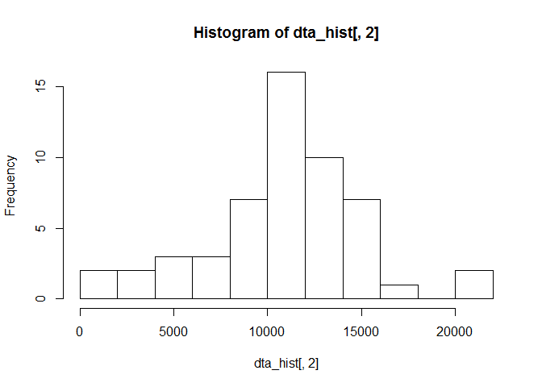
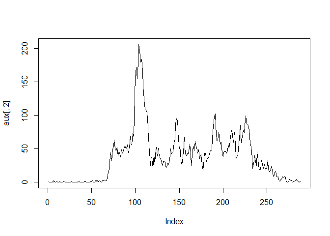

# Reproducible Research: Peer Assessment 1


## Loading and preprocessing the data

```r
unzip("activity.zip", files="activity.csv")
dta <- read.csv("activity.csv")
dta_2 <- dta[!is.na(dta$steps),] 
dta_hist <- data.frame(date=levels(dta_2$date))
for (i in dta_2$date) {
      dta_hist[match(i,dta_hist$date),2] <- sum(dta_2[dta_2$date==i,"steps"])
}
```


## What is mean total number of steps taken per day?

```r
hist(dta_hist[,2], breaks=10)
```

 

```r
mean(dta_hist[!is.na(dta_hist[,2]),2])
```

```
## [1] 10766.19
```

```r
median(dta_hist[!is.na(dta_hist[,2]),2])
```

```
## [1] 10765
```


## What is the average daily activity pattern?

```r
aux <- data.frame(interval=simplify2array(labels(table(dta_2$interval))))

for (i in aux[,1]) {
      aux[match(i,aux[,1]),2] <- mean(dta_2$steps[dta_2$interval==i], na.rm=TRUE)
}

plot(aux[,2], type="l")
```

 

```r
aux[match(max(aux[,2]),aux[,2]),1]
```

```
## [1] 835
## 288 Levels: 0 10 100 1000 1005 1010 1015 1020 1025 1030 1035 1040 ... 955
```


## Imputing missing values


## Are there differences in activity patterns between weekdays and weekends?
